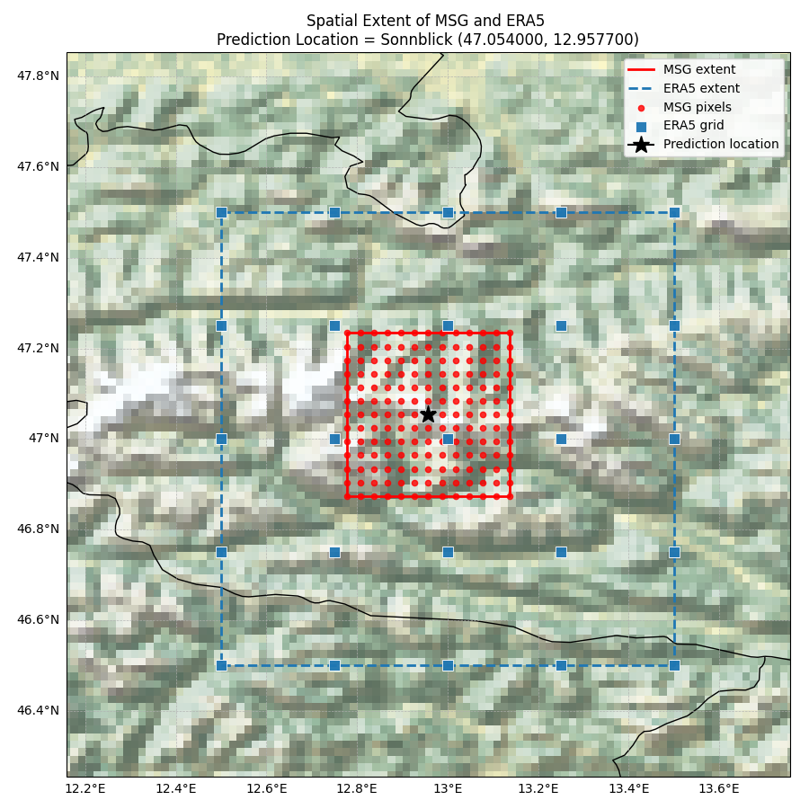
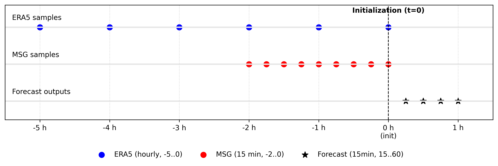

# 15-Minute Solar Irradiance Nowcasting using a Spatio-temporal Fourier Transformer model

Accurate, local solar irradiance forecasts are essential for solar energy production. This
project investigates solar irradiance forecasting with machine learning by using a
spatio-temporal Fourier transformer architecture. Coarse atmospheric information has been
combined with local cloud data to generate predictions which address weaknesses in the ECMWF's
Artificial Intelligence Forecasting System (AIFS). A site-specific and general model were
developed to predict solar irradiance at 15 minute intervals up to an hour ahead for specific
coordinates. Results show that both models achieve a lower root-mean-square error than AIFS,
with the site-specific model showing particularly strong performance during high cloud cover.

## Background

Solar irradiance exhibits large temporal fluctuations owing to cloud movement and the diurnal
cycle, which have significant effects on the energy produced by photovoltaic plants. Access to
accurate forecasts allows grid operators to anticipate these variations in energy supply and
thus balance the supply and demand of the grid, creating greater reliability. Furthermore,
knowledge of these fluctuations allows solar farms to charge and discharge their energy stores
more efficiently.

The European Centre for Medium-Range Weather Forecasts (ECMWF) released a new AI Forecasting
System (AIFS) [1], operational since February 2025, which outperforms ECMWF's numerical weather
prediction models on many variables. Although AIFS performs strongly in many aspects, for use in
solar plants it has several limits. Firstly, because AIFS predicts over 100 variables, it has no
particular focus — useful for general weather forecasting, but it lacks specialised solar
irradiance capabilities. Secondly, the resolution of AIFS is a 0.25° grid (roughly 25 km); solar
farms are generally smaller than this and need more localised forecasts to accurately predict
fluctuations in energy production. Finally, AIFS is trained using the ECMWF Reanalysis v5 (ERA5)
database, which limits the accuracy of AIFS by not considering important physical features that
affect solar irradiance, such as cloud cover.

This project aims to create a forecast which predicts solar irradiance to a higher temporal
resolution than AIFS, and with closer alignment to the ground-truth as measured by weather
stations. To achieve this, a Spatio-temporal Fourier Transformer machine learning architecture
is used to build on AIFS's model, by combining it with satellite data on cloud cover to achieve
a more robust prediction. For training, historic data from the ERA5 database and data from
METEOSAT second-generation (MSG) satellites are used, which combine to give a more expansive
foundation for prediction.

## Model architecture


The models are built on a Spatio-temporal Fourier Transformer (StFT) architecture [2] — a state
of the art architecture proposed in March 2025 for simulating dynamics of multi-scale and
multi-physics systems, for which these models act as a proof of concept. Where regular
transformers only take the raw spatial and temporal data as inputs and learn patterns from
these, StFT models apply a Fourier transform to the spatial data to obtain spectral channels.
Only the low frequency modes of the spectral representations are retained, so the model can
learn long-range interactions more freely. The spectral and spatial channels are both kept, and
run in parallel before recombination, giving the model the ability to learn interactions across
different scales.

Starting with the MSG inputs, the 13x13 grid of points is converted into sub-patches made of
overlapping 5x5 points, before being fed into the encoder. This allows small areas with cloud
features to be interpreted by the model rather than single points. These patches then pass
through the encoder, which converts the raw data into units the model can operate on, called
tokens. During this encoding, the MSG data learns internal interactions before being output as
tokens. Simultaneously, the ERA5 data is split into a spatial channel and Fourier channel, and
encoded before these two channels are recombined into a pool of ERA5 tokens, containing both
spatial and Fourier information. The MSG tokens and ERA5 tokens interact by cross attention —
the process of the separate data sources learning relations from each other. Specifically, the
MSG tokens query the ERA5 tokens to see how the large scale atmospheric conditions influence
cloud processes locally to the prediction location. Next, the processed MSG and ERA5 data are
combined with initialisation time and forecasting location information in the fusion
transformer, before passing through attention pooling, where the interactions are once again
learned. Finally, an MLP (Multi-Layer Perceptron) head converts these tokens into a final
output, in the form of 4 quarter-hourly predictions for the coming hour.

## Training data

For training, the models rely on two sources of input that complement each other in terms of
spatial and temporal scale.

**ERA5** is used to gain coarse atmospheric information on the local region. ERA5 provides a
reconstruction of the Earth's atmosphere from 1940 to near real time by combining historical
observations with modern numerical weather prediction models, on a 0.25° grid for over 300
distinct variables. For each forecast initialisation time, the models are trained on a 5 x 5
grid of points, hourly, for the 5 hours before initialisation time. For each of these points,
the solar short-wave radiation downwards, 2m temperature, and 2m dewpoint temperature are input
into the model. Solar short-wave radiation downwards is used because this is the forecast
output, giving the models information on how this is evolving prior to the forecasting window.
2m temperature is the surface air temperature and correlates closely with cloud cover, while
also capturing the diurnal cycle. 2m dew-point temperature reflects the near-surface moisture
content, which influences the likelihood of cloud formation and presence of fog clouds.

**MSG** (Meteosat Second Generation) data is incorporated to learn location-specific behaviour,
beyond the atmospheric context provided by ERA5. This comes from geostationary satellites
positioned over the equator, providing continuous coverage of Europe, Africa and the surrounding
regions. The primary instrument SEVIRI (Spinning Enhanced Visible and Infrared Imager) measures
radiation in 12 spectral channels, from which cloud properties are derived, on a 3 km grid at 15
minute intervals. For each forecast initialisation time, the models are trained on a 13 x 13
grid of points (40 km in extent), every 15 minutes, for the 2 hours prior to initialisation. The
MSG variable being used is cloud mask, which assigns a value of one for cloud and zero for clear
to each point on the grid — this is the primary cloud variable that impacts solar irradiance, as
it provides information on whether sunlight is being blocked before reaching the surface.





The final input is the initialisation time, which contributes to the models' understanding of
the diurnal cycle by giving the model an awareness of when in the cycle the forecast is being
computed.

For ground truth, solar irradiance data from the Baseline Surface Radiation Network (BSRN) is
used. Based on correlations between training data and ground truth, the models predict a
correction to AIFS forecasts.

### Supported ground-truth stations

The BSRN weather stations used for training/evaluation in this project, with verified
coordinates (see `Sample_Download.py`'s `--site`/`--lat`/`--lon` arguments):

| Site | Code | Latitude | Longitude |
|------|------|----------|-----------|
| Budapest | BUD | 47.4291 | 19.1822 |
| Cabauw | CAB | 51.9680 | 4.9280 |
| Cener | CNR | 42.8160 | -1.6010 |
| Florianópolis | FLO | -27.6047 | -48.5227 |
| Gobabeb | GOB | -23.5614 | 15.0420 |
| Izaña | IZA | 28.3093 | -16.4993 |
| Lampedusa | LMP | 35.5180 | 12.6300 |
| Paramaribo | PAR | 5.8060 | -55.2146 |
| Payerne | PAY | 46.8123 | 6.9422 |
| Réunion Island | RUN | -20.9014 | 55.4836 |
| Sonnblick | SON | 47.0540 | 12.9577 |
| Tamanrasset | TAM | 22.7903 | 5.5292 |
| Tõravere | TOR | 58.2641 | 26.4613 |

## Pipeline overview

1. **`Sample_Download.py`** — single CLI that downloads all raw data sources for one site (AIFS
   forecast, ERA5 reanalysis, MSG cloud mask, station ground truth) and builds the resulting
   `.npz` training samples. Each training sample is comprised of a 5x5 grid of hourly ERA5 data
   (solar short-wave radiation downwards, 2m temperature, 2m dew-point temperature) for the 5
   hours prior to initialisation, a 13x13 grid of 15-minute MSG cloud-mask data for the 2 hours
   prior to initialisation, the AIFS baseline forecast, and the BSRN ground-truth measurement.
2. **`Function_Single_Sample_to_Tensor.py`** / **`Function_Batch_Maker.py`** — convert `.npz`
   samples into the batched tensor format the model consumes (`Dataset` + custom `collate_fn`).
3. **`StFT_Model_Single.py`** / **`StFT_Model_General.py`** — the two model architectures.
   `Single` is tied to one station; `General` is a larger model additionally conditioned on each
   sample's lat/lon, so one trained model can generalize across multiple sites.
4. **`Evaluate.py`** — runs a trained checkpoint against held-out samples, scores it (RMSE
   overall, day/night, and by cloud-cover bucket) against both ground truth and the raw AIFS
   baseline, and produces comparison plots.
5. **`StFT_Model_Single_Train_Eval.py`** — combined train + validate + held-out-evaluate script
   for the `Single` model. Splits samples chronologically 70% train / 20% validation / 10%
   held-out evaluation: trains and checkpoints on the 70/20 split (identical to the standalone
   training loop), then runs the never-touched final 10% through `Evaluate.py`'s own scoring
   logic for an unbiased final RMSE breakdown. This is the recommended way to train and evaluate
   the `Single` model end to end; it imports and depends on `Evaluate.py` directly, so that file
   must stay in the repo even if you don't run it standalone.
6. **`StFT_Model_General_Train_Eval.py`** — the same combined train + validate + held-out-evaluate
   script, adapted for the `General` model's pooled multi-site samples. Since a single site's
   percentage-based split doesn't generalise safely once several sites' files are pooled
   together, this instead splits by the calendar month of each sample's `t_init`: validation and
   evaluation months are held out the same way for every site regardless of which file they
   belong to (default validation = May/November, evaluation = August, matching the methodology
   used for both models — configurable via `--val-months`/`--eval-months`). Each sample's
   `site_id` is carried through into the output CSVs for traceability. Also depends on
   `Evaluate.py` directly.

## Prerequisites

Install dependencies:
```bash
pip install -r requirements.txt
```

A few packages need extra setup beyond `pip install`:
- **`pygrib`** / **`cfgrib`** depend on the `eccodes` C library. If `pip install` fails for
  `pygrib`, install via conda instead: `conda install -c conda-forge pygrib`.
- **`cdsapi`** (used for ERA5 downloads) requires a configured `~/.cdsapirc` — see the [CDS API
  documentation](https://cds.climate.copernicus.eu/api-how-to) for how to set this up with your
  own Copernicus account.
- **`torch`** — install using the command for your machine (CPU vs CUDA) from
  [pytorch.org/get-started/locally](https://pytorch.org/get-started/locally/).

Environment variables required for the `msg` download step:
```bash
export EUMETSAT_CONSUMER_KEY="your-key-here"
export EUMETSAT_CONSUMER_SECRET="your-secret-here"
```
(Obtained from a EUMETSAT Data Store account.)

**Note:** the EUMETSAT Data Store API enforces a maximum number of product requests per
call/session. For a large date range, the `msg` step may need to be run in smaller chunks (via
`--msg-start`/`--msg-end`) to stay under this limit; it resumes automatically across separate
runs, so chunking does not lose progress.

## The one manual step: ground-truth data

Station radiation ("ground truth") data comes from [PANGAEA](https://www.pangaea.de/)/BSRN and
has no download API. Data can be found at https://www.pangaea.de/?q=%40BSRNcollection
Before running the `ground` step, manually download the relevant monthly
`{SITE}_radiation_YYYY-MM.tab` files from PANGAEA and place them in your `--raw-tab-dir`
(defaults to `--data-dir`).

## Usage

Run the full pipeline for one site and date range:
```bash
python Sample_Download.py --site BUD --lat 47.4291 --lon 19.1822 \
  --start 2026-01-01 --end 2026-03-31 \
  --data-dir dataBUD --samples-dir samples --raw-tab-dir raw_ground
```
Use `--steps` to run a subset (e.g. `--steps aifs,era5`), and `--skip-existing` to skip a step
whose output already exists. See the script's own docstring/`--help` for the full set of
options.

Train and evaluate the `Single` model end to end (recommended):
```bash
python StFT_Model_Single_Train_Eval.py --samples_dir samples --epochs 20 \
  --save_path stft_single.pt --cloud dataBUD/BUD_cloudmask_sample_prep.csv
```
`--cloud` is optional — omit it to skip the cloud-cover-bucket breakdown in the final held-out
evaluation and still get overall/day/night RMSE. See the script's own docstring for the
alternative `--train_dir`/`--val_dir`/`--eval_dir` mode.

Train and evaluate the `General` model on pooled multi-site samples (run `Sample_Download.py`
for each site into the same `--samples-dir` first — filenames are site-suffixed, so this pools
with no collisions):
```bash
python StFT_Model_General_Train_Eval.py --samples_dir samples_all --epochs 20 \
  --save_path stft_general.pt --cloud dataBUD/BUD_cloudmask_sample_prep.csv
```
`--val-months`/`--eval-months` override the default May+November / August split if needed.

Evaluate an already-trained checkpoint against an arbitrary sample set directly (e.g. a
different site, date range, or to compare several checkpoints at once):
```bash
python Evaluate.py --model your_checkpoint.pt --samples samples --outdir eval_out
```

## Results

Both models were evaluated against the AIFS baseline for August 2025 (all RMSE values in units
of J/m²/15 mins).

**Site-specific model**, trained and evaluated at Sonnblick, Austria:

| Metric | All | Day | Night | Cloud < 0.25 | 0.25–0.5 | 0.5–0.75 | ≥ 0.75 |
|---|---|---|---|---|---|---|---|
| Baseline RMSE | 128005.88 | 172874.14 | 55219.33 | 110568.00 | 129908.56 | 112105.66 | 143632.00 |
| Site-Specific Model RMSE | 105941.01 | 145187.39 | 38562.71 | 89279.48 | 122243.23 | 105682.92 | 110783.81 |
| Improvement (%) | 17.23 | 16.02 | 30.16 | 19.25 | 5.90 | 5.73 | 22.87 |

The site-specific model achieves a 17.23% lower RMSE than AIFS overall, with the greatest
improvement seen when cloud fraction ≥ 0.75 — i.e. the inclusion of MSG cloud mask data
specifically addresses AIFS's weakness during cloudy conditions.

**General model**, trained across all stations except Sonnblick, evaluated on Sonnblick as an
unseen location:

| Metric | All | Day | Night | Cloud < 0.25 | 0.25–0.5 | 0.5–0.75 | ≥ 0.75 |
|---|---|---|---|---|---|---|---|
| Baseline RMSE | 128005.88 | 172874.14 | 55219.33 | 110568.00 | 129908.56 | 112105.66 | 143632.00 |
| General Model RMSE | 114385.34 | 157663.72 | 38116.66 | 94358.61 | 127675.79 | 103760.15 | 125839.95 |
| Improvement (%) | 10.64 | 8.80 | 30.97 | 14.66 | 1.72 | 7.44 | 12.39 |

The general model achieves a 10.64% lower RMSE than AIFS at this unseen location, demonstrating
generalisation ability, but with a notably larger absolute improvement at night than during the
day. Since AIFS already performs relatively well at night, this suggests the general model is
mostly correcting recurring non-physical/interpolation biases in AIFS rather than learning
location-specific physical cloud behaviour — unlike the site-specific model, whose largest
improvements are during high cloud cover, consistent with genuinely physics-based correction.

Note: these results were achieved in April 2025 with the models trained on all data available at
that time. The training data was limited by AIFS reaching operational status (Febuary 2025), and
the latest ground truth data released by BSRN (December 2025)

## Limitations and future work

This project is a **proof of concept for the model architecture**, not an operational
nowcasting system. In particular, it is not currently deployable in real time because one of
its inputs — **ERA5 reanalysis** — is not released with low enough latency to support a live
nowcast: ERA5 (and its near-real-time preliminary product, ERA5T) is published with a delay of
several days behind the actual valid time, whereas this model needs ERA5 covering the *same*
window it is nowcasting. Closing this gap (e.g. substituting a lower-latency input, or otherwise
reworking this dependency) is ongoing work, not something this repository currently solves.

The training period used (26 February 2025 – 31 December 2025) is below a year, meaning the
models are not exposed to the full range of seasonal variations; performance could be improved
with a greater backlog of training data as more is released by BSRN. In addition, Meteosat Third
Generation (MTG) satellites have recently become operational and supply better imaging and
atmospheric sounding data than MSG. Cloud opacity and height could be added as input parameters
using this improved data — currently the only cloud information used is cloud mask, a binary
value. Cloud opacity would give information on how much solar radiation is transmitted through
clouds, and cloud height would give information on indirect solar radiation reaching a location
relative to clouds.

## Data source attribution

This project relies on several third-party data sources, each with its own license/attribution
terms:
- **AIFS** forecast data — [ECMWF](https://www.ecmwf.int/)
- **ERA5** reanalysis — [Copernicus Climate Change Service (C3S)](https://climate.copernicus.eu/)
- **MSG cloud mask** — [EUMETSAT](https://www.eumetsat.int/)
- **Ground-truth station radiation** — [BSRN](https://bsrn.awi.de/) via [PANGAEA](https://www.pangaea.de/)

Raw data from these sources is not included in this repository — the scripts above
download/format it directly from each provider.

## References

[1] Gabriel Moldovan, Ewan Pinnington, Ana Prieto Nemesio, Simon Lang, Zied Ben Bouallègue,
Jesper Dramsch, Mihai Alexe, Mario Santa Cruz, Sara Hahner, Harrison Cook, Helen Theissen,
Mariana Clare, Cathal O'Brien, Jan Polster, Linus Magnusson, Gert Mertes, Florian Pinault,
Baudouin Raoult, Patricia de Rosnay, Richard Forbes, and Matthew Chantry. An update to ecmwf's
machine-learned weather forecast model aifs, 2025.

[2] Da Long, Shandian Zhe, Samuel Williams, Leonid Oliker, and Zhe Bai. Stft: Spatio-temporal
fourier transformer for long-term dynamics prediction, 2025.
